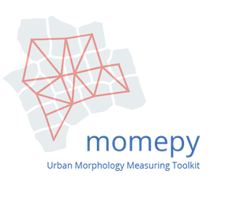

momepy documentation
==================================

Introduction
------------

Momepy is a project allowing advanced quantitative analysis of urban
morphology. Embracing principles of *Urban Morphometrics* (Dibble,
2017), this toolkit aims to provide tools for the development of complex
frameworks for a description of urban structures.

    *momepy* stands for Morphological Measuring in Python

Momepy is a result of ongoing research of `Urban
Design Studies Unit (UDSU) <http://udsu-strath.com>`__ supported by the
Axel and Margaret Ax:son Johnson Foundation as a part of “The Urban Form
Resilience Project” in partnership with University of Strathclyde in Glasgow,
UK.

Comments, suggestions, feedback, and contributions, as well as bug
reports, are very welcome.

https://github.com/martinfleis/momepy

Install
-------

You can install ``momepy`` using Conda from conda-forge (recommended)::

  conda install -c conda-forge momepy

or from PyPI using pip::

  pip install momepy

See the :doc:`installation docs <install>` for detailed instructions.
Momepy depends on python geospatial stack, which might cause some dependency
issues.

Contributing to momepy
----------------------

Contributions of any kind to momepy are more than welcome. That does not mean
new code only, but also improvements of documentation and user guide, additional
tests (ideally filling the gaps in existing suite) or bug report or idea what
could be added or done better.

All contributions should go through our GitHub repository. Bug reports, ideas or
even questions should be raised by opening an issue on the GitHub tracker.
Suggestions for changes in code or documentation should be submitted as a pull
request. However, if you are not sure what to do, feel free to open an issue.
All discussion will then take place on GitHub to keep the development of momepy
transparent.

If you decide to contribute to the codebase, ensure that you are using an
up-to-date `master` branch. The latest development version will always be there,
including a significant part of the documentation (powered by `sphinx`). The
user guide is located in the `gh-pages` branch and is powered by `Jupyter book`.

Details are available in the :doc:`contributing guide <contributing>`.

Get in touch
------------
If you have a question regarding momepy, feel free to open an issue on GitHub.
Eventually, you can contact us on dev@momepy.org.

Documentation contents
----------------------
.. toctree::
   :maxdepth: 1

   install
   tutorial
   api
   contributing
   references

Indices and tables
==================

* :ref:`genindex`
* :ref:`modindex`
* :ref:`search`
