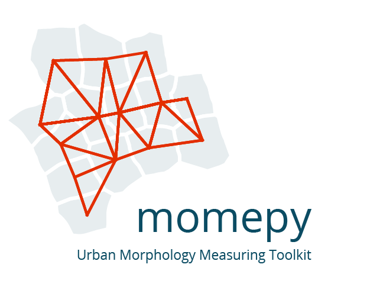
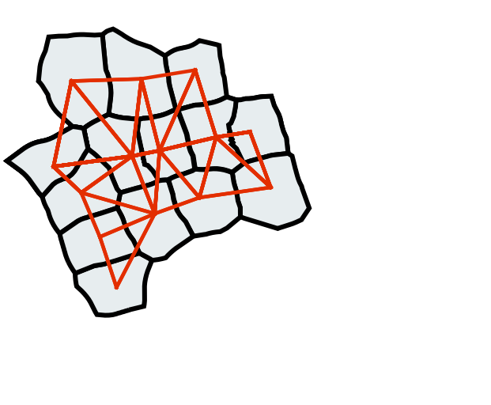

momepy documentation
==================================

Introduction
------------

Momepy is a library for quantitative analysis of urban form - urban
morphometrics. It is part of `PySAL (Python Spatial Analysis Library)`_
and is built on top of `GeoPandas`_, other `PySAL`_ modules and
`networkX`_.

    *momepy* stands for Morphological Measuring in Python

Some of the functionality that momepy offers:

-  Measuring **dimensions** of morphological elements, their parts, and
   aggregated structures.
-  Quantifying **shapes** of geometries representing a wide range of
   morphological features.
-  Capturing **spatial distribution** of elements of one kind as well as
   relationships between different kinds.
-  Computing density and other types of **intensity** characters.
-  Calculating **diversity** of various aspects of urban form.
-  Capturing **connectivity** of urban street networks
-  Generating relational **elements** of urban form (e.g. morphological
   tessellation)

Momepy aims to provide a wide range of tools for a systematic and
exhaustive analysis of urban form. It can work with a wide range of
elements, while focused on building footprints and street networks.

Comments, suggestions, feedback, and contributions, as well as bug
reports, are very welcome.

The package is currently maintained by `@martinfleis`_ and `@jGaboardi`_.

https://github.com/pysal/momepy

Install
-------

You can install ``momepy`` using Conda from conda-forge (recommended)::

  conda install -c conda-forge momepy

or from PyPI using pip::

  pip install momepy

See the :doc:`installation docs <install>` for detailed instructions.
Momepy depends on python geospatial stack, which might cause some dependency
issues.

Examples
--------

.. code:: py

   tessellation['area_simpson'] = momepy.simpson(tessellation.area, contiguity_k3)

.. figure:: https://raw.githubusercontent.com/pysal/momepy/main/docs/_static/diversity_22_0.png
   :alt: Local Simpson's diversity of area

   Local Simpson's diversity of area

.. code:: py

   G = momepy.straightness_centrality(G)

.. figure:: https://raw.githubusercontent.com/pysal/momepy/main/docs/_static/centrality_27_0.png
   :alt: Straightness centrality

   Straightness centrality

Citing
------

To cite ``momepy`` please use following `software paper <https://doi.org/10.21105/joss.01807>`__
published in the JOSS.

Fleischmann, M. (2019) ‘momepy: Urban Morphology Measuring Toolkit’, Journal of Open
Source Software, 4(43), p. 1807. doi: 10.21105/joss.01807.

BibTeX::

    @article{fleischmann_2019,
        author={Fleischmann, Martin},
        title={momepy: Urban Morphology Measuring Toolkit},
        journal={Journal of Open Source Software},
        year={2019},
        volume={4},
        number={43},
        pages={1807},
        DOI={10.21105/joss.01807}
    }

Contributing to momepy
----------------------

Contributions of any kind to momepy are more than welcome. That does not mean
new code only, but also improvements of documentation and user guide, additional
tests (ideally filling the gaps in existing suite) or bug report or idea what
could be added or done better.

All contributions should go through our GitHub repository. Bug reports, ideas or
even questions should be raised by opening an issue on the GitHub tracker.
Suggestions for changes in code or documentation should be submitted as a pull
request. However, if you are not sure what to do, feel free to open an issue.
All discussion will then take place on GitHub to keep the development of momepy
transparent.

If you decide to contribute to the codebase, ensure that you are using an
up-to-date ``main`` branch. The latest development version will always be there,
including the documentation (powered by ``sphinx``).

Details are available in the :doc:`contributing guide <contributing>`.

Get in touch
------------
If you have a question regarding momepy, feel free to open an
`issue`_, a new `discussion`_ on GitHub or join a chat on `Discord`_.

Acknowledgements
----------------
Initial release of momepy was a result of a research of `Urban Design
Studies Unit (UDSU)`_ supported by the Axel and Margaret Ax:son Johnson
Foundation as a part of “The Urban Form Resilience Project” in
partnership with University of Strathclyde in Glasgow, UK. Further
development was supported by `Geographic Data Science Lab`_ of the
University of Liverpool wihtin `Urban Grammar AI`_ research project.

Documentation contents
----------------------
.. toctree::
   :maxdepth: 1

   Home <self>
   install
   user_guide/intro
   examples/index
   API reference <api>
   Contributing <contributing>
   Changelog <https://github.com/pysal/momepy/releases>
   references

Indices and tables
==================

* :ref:`genindex`
* :ref:`modindex`
* :ref:`search`

.. _PySAL (Python Spatial Analysis Library): http://pysal.org
.. _GeoPandas: http://geopandas.org
.. _PySAL: http://pysal.org
.. _networkX: http://networkx.github.io
.. _Urban Design Studies Unit (UDSU): http://udsu-strath.com
.. _Geographic Data Science Lab: https://www.liverpool.ac.uk/geographic-data-science/
.. _Urban Grammar AI: https://urbangrammarai.xyz
.. _@martinfleis: http://github.org/martinfleis
.. _@jGaboardi: http://github.org/jGaboardi
.. _issue: https://github.com/pysal/momepy/issues/new/choose
.. _discussion: https://github.com/pysal/momepy/discussions
.. _Discord: https://discord.gg/he6Y8D2ap3