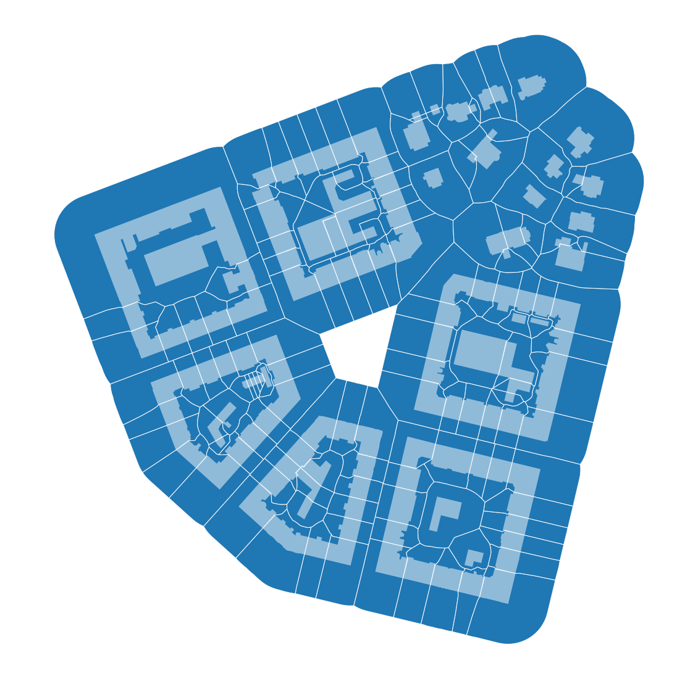

# Summary

Urban morphology is the area of urban studies that explores the physical form of cities in space and the way it changes in time in relation to the agents of such change [@Kropf:2017tw]. The discipline is based on the analysis of space, traditionally mostly visual and qualitative [@2015arXiv150604875D]; its objects are the fundamental elements of urban form (building, plot, street) [@Moudon:1997wk] as well as a range of analytical constructs such as axial maps [@ArizaVillaverde:2013bt] or proximity bands [@Araldi:2019kv]. The increased availability of morphological data and computational power have led in time to more emphasis on quantitative forms of analysis, and the emergence of Urban Morphometrics (UMM) [@Dibble:2017bz]: this approach describes urban form via the systematic and comprehensive measurement of its morphological characters. Since UMM analysis is addressed both in-depth and at large scale, it is grounded on the intensive use of GIS software (proprietary ArcGIS, MapInfo, open-source QGIS) either through built-in processing tools or specific plugins like Urban Network Analysis [@Sevtsuk:2012ixa] or Place Syntax Tool [@Stahle469861]. However, essential functions to conduct such measurements on specific urban morphometric characters or processes such as morphological tessellation, are not always available: current plugins offer only a limited number of functionalities as they are mainly application or case-specific. This paper is hereby proposing ``momepy``, a Python toolkit which aims to overcome such limitations by enabling a systematic in-depth analysis of urban form, to comprehensively include a wide range of measurable characters, with a prospect of expanding future development due to its open-source nature and independence on proprietary software or operating systems. The development of momepy is timely, as the role of measurable characters is vital to recognize form-based patterns and establish descriptive and analytical frameworks of human settlements, in the “age of urbanization”.

The morphometric characters implemented in momepy allow to conduct a cross-scale analysis of urban form, spanning from the level of individual buildings and plots to the macroscopic metropolitan regions. Furthermore, ``momepy`` is designed to be more flexible than other toolkits as its functions are generally not restricted to specific morphological elements but to geometry types only and as such, can be used in various analytical models.

The six core modules of ``momepy``, represent six categories of urban morphometric characters: ``dimension``, ``shape``, spatial ``distribution``, ``intensity``, connectivity (``graph`` module), and ``diversity`` identified in the literature and ongoing research. These six modules together provide a wide range of algorithms measuring different aspects of urban form and are able to describe its complexity with a significant degree of precision.

Moreover, the ``elements`` module allows for generating morphological elements and provides a way of linking all relevant elements together using unique IDs based on their spatial proximity. This module provides a function to generate morphological tessellation of the built-up area (figure 1) based on the spatial configuration of building footprints using the Voronoi tessellation as implemented in SciPy [@SciPy:suv-1Mya], used within UMM as a proxy of a plot. This module also allows for generating tessellation-based urban blocks as a higher scale aggregation.

The application of morphological tessellation and PySAL’s [@Rey2010] spatial weights as used within momepy enables the relational definition of location-based aggregation, allowing the consistent morphology-led definition of the vicinity of each element of the urban form [@Fleischmann:2019vq].  

Additionally, the ``utils`` module helps, among others, to pre-process data, by cleaning either the topology of street networks or of ancillary structures from the building footprint data, both needed to eliminate possible error later in the analysis.

Internally, ``momepy`` is built on the GeoPandas Python package [@kelsey_jordahl_2019_3483425], using its GeoSeries and GeoDataFrame objects to store and handle large amounts of geospatial information. ``momepy`` uses PySAL under the hood, mostly to take care of spatial weights matrices capturing the adjacency of elements of urban form. The graph module uses the capabilities of networkX [@SciPyProceedings_11] for the analysis of urban street networks. Basic Python knowledge is required to use ``momepy``, but example Jupyter notebooks should provide enough information to allow using momepy with a standard GIS knowledge only.
Momepy depends on Python geospatial libraries, so the recommended installation uses the community-led conda-forge channel of conda to ensure compatibility of all dependencies: ``conda install -c conda-forge momepy``. Eventually, ``pip install momepy`` is possible considering all dependency requirements are met.
``momepy``  is currently being used to measure the specific aspects of urban form that contribute to its resilience [@Feliciotti:2016vu], as part of *The Urban Form Resilience Project*, and to describe urban form using extensive number of morphometric characters (300+) aimed at recognition of homogenous areas as part of the doctoral research *The Urban Atlas: Developing tools and frameworks for quantitative analysis of urban form through Geographical Information Systems and big data*, both based at the University of Strathclyde, Glasgow. At the same time, ``momepy`` is being used as a tool for climate-induced risk assessment of Portuguese seashore streets, through a cooperation between the Universidade de Lisboa and the University of Strathclyde.

# Acknowledgements
This work was supported by the Axel and Margaret Ax:son Johnson Foundation as part of *The Urban Form Resilience Project*, in partnership with the University of Strathclyde in Glasgow, UK

# References
